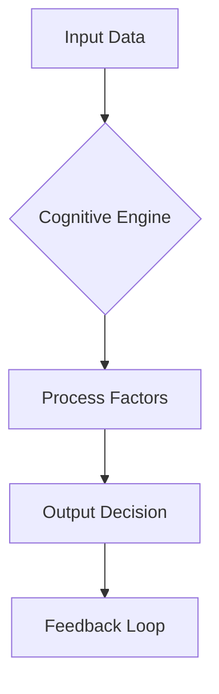

## Overview

CUSNIR OS empowers you to manage complex governance and decision-making processes through its cognitive framework. You access a intuitive user interface in demo mode without authentication, though full features require login. Explore decision-making tools, policy modules, cognitive elements, and streamlined workflows to optimize your operations.

<Columns cols={2}>
  <Card title="Decision Tools" icon="zap" href="#decision-tools">
    Analyze options with AI-driven insights.
  </Card>
  <Card title="Governance Modules" icon="shield" href="#governance">
    Enforce policies across your organization.
  </Card>
  <Card title="Cognitive Elements" icon="brain" href="#cognitive">
    Leverage processing for smarter decisions.
  </Card>
  <Card title="UI Workflows" icon="workflow" href="#workflows">
    Navigate seamlessly from dashboard to action.
  </Card>
</Columns>

## Decision-Making Tools

You use CUSNIR OS decision-making tools to evaluate scenarios with cognitive scoring. Input options, and the system generates risk assessments and recommendations.

<Callout kind="tip">
  Start in demo mode at `https://dashboard.example.com/cusnir-os` to test tools without signup.
</Callout>

<Tabs>
  <Tab title="Basic Analysis" icon="search">
    Select scenarios and run evaluations.
    
    <Steps>
      <Step title="Define Options" icon="edit">
        Enter up to 10 decision alternatives.
      </Step>
      <Step title="Run Analysis" icon="play">
        Click Analyze to process with cognitive engine.
      </Step>
      <Step title="Review Scores" icon="bar-chart">
        View ranked outcomes with confidence levels.
      </Step>
    </Steps>
  </Tab>
  <Tab title="Advanced Simulation" icon="settings">
    Simulate multi-variable impacts.
    
````javascript
// Simulate decision via API
const response = await fetch('https://api.example.com/cusnir/simulate', {
  method: 'POST',
  headers: { 'Authorization': `Bearer ${YOUR_TOKEN}` },
  body: JSON.stringify({
    options: ['Option A', 'Option B'],
    variables: { risk: 0.3, reward: 0.7 }
  })
});
const results = await response.json();
console.log(results.scores);
````
  </Tab>
</Tabs>

## Governance and Policy Modules

Manage policies with CUSNIR OS governance modules. You define rules, assign roles, and track compliance in real time.

<ParamField path="policy.id" param-type="string" required="true">
  Unique policy identifier.
</ParamField>

<ParamField body="rules" param-type="array" required="false">
  Array of rule objects defining enforcement logic.
</ParamField>

## Cognitive Processing Elements

CUSNIR OS cognitive elements process data through neural-like networks. You configure weights for factors like ethics, efficiency, and impact.



<CodeGroup tabs="JSON,TypeScript">
````json
{
  "weights": {
    "ethics": 0.4,
    "efficiency": 0.3,
    "impact": 0.3
  },
  "threshold": 0.7
}
````
````typescript
interface CognitiveConfig {
  weights: { ethics: number; efficiency: number; impact: number };
  threshold: number;
}

const config: CognitiveConfig = {
  weights: { ethics: 0.4, efficiency: 0.3, impact: 0.3 },
  threshold: 0.7
};
````
</CodeGroup>

<Expandable title="Advanced Weight Tuning" default-open="false">
  Fine-tune elements for domain-specific needs. Adjust via dashboard sliders or API.
</Expandable>

## User Interface Workflows

Navigate CUSNIR OS workflows effortlessly. From login to execution, you follow guided paths.

<Steps>
  <Step title="Access Dashboard" icon="home">
    Visit `https://dashboard.example.com/cusnir-os`.
  </Step>
  <Step title="Select Module" icon="menu">
    Choose from Decision, Governance, or Cognitive tabs.
  </Step>
  <Step title="Execute Workflow" icon="rocket">
    Follow prompts to complete actions.
  </Step>
</Steps>

<Callout kind="info">
  Demo mode limits exports; authenticate for full access.
</Callout>

These features integrate seamlessly, enabling you to govern effectively with cognitive intelligence.